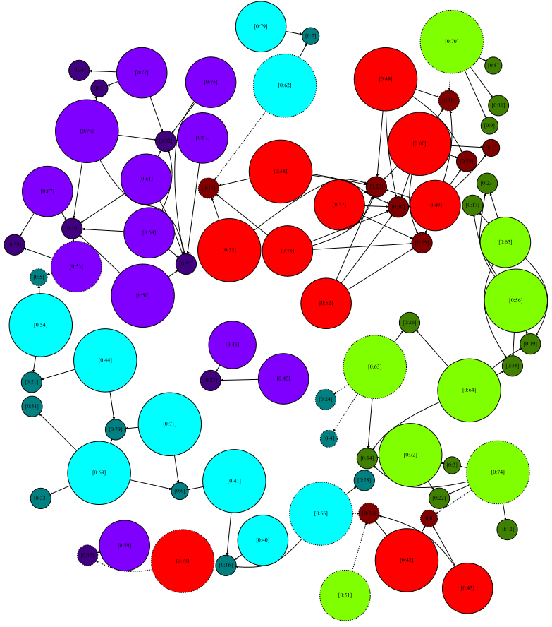

# FPMAS

FPMAS is an HPC (High Performance Computing) Multi-Agent simulation platform
designed to run on massively parallel and distributed memory environments,
such as computing clusters.

The main advantage of FPMAS is that it is designed to abstract as much as
possible MPI and parallel features to the final user. No distributed computing
skills are required to run Multi-Agent simulations on hundreds of processor
cores.

Moreover, FPMAS offers powerful features to allow **concurrent write
operations accross distant processors**. This allows users to easily write
general purpose code without struggling with distributed computing issues,
while still allowing an implicit large scale distributed execution.

FPMAS also automatically handles load balancing accross processors to
distribute the user defined Multi-Agent model on the available computing
resources.

The underlying synchronized distributed graph structure used to represent
Multi-Agent models might also be used in applications that are not related
to Multi-Agent Systems to take advantage of other features such as load
balancing or write operations across processes.



# Installation
## Dependencies

FPMAS requires the following tools, see the corresponding documentations to
install them :
- [g++](https://gcc.gnu.org/) 6.4 or higher
- [CMake](https://cmake.org/) 3.10 or higher
- [Open MPI](https://www.open-mpi.org/) 3 or 4
- [nlohmann/json C++ library](https://github.com/nlohmann/json) 3.7 or higher
- [zoltan C/C++ library](https://github.com/sandialabs/Zoltan) 3.81 or higher

#### Ubuntu

```
sudo apt-get install g++ cmake libopenmpi3 nlohmann-json3-dev
```

#### Archlinux

```
sudo pacman -S gcc cmake openmpi nlohmann-json
```

#### Zoltan Installation

Zoltan is currently not distributed as a package in most common distributions,
so it is required to install it manually.

```
git clone https://github.com/sandialabs/Zoltan
```

```
cd Zoltan
mkdir build
cd build
../configure --with-id-type=ulong
make everything
sudo make install
```

By default, `Zoltan` is installed in `/usr/local`. Other directory might be
specified. For example:
```
../configure --with-id-type=ulong --prefix=$HOME
```

The custom installation directory must then be specified as explained below.

The `--with-id-type` option is optional but recommended. By default, Zoltan
uses `unsigned int`, what is not very efficient in the case of FPMAS.

See the [Zoltan
documentation](https://htmlpreview.github.io/?https://raw.githubusercontent.com/sandialabs/zoltan/master/doc/Zoltan_html/ug_html/ug_usage.html)
for more detailed installation instructions.

## FPMAS

To use the latest FPMAS version, you can directly clone this repository :
```
git clone https://github.com/FPMAS/FPMAS
```

FPMAS can be built and installed using CMake :
```
mkdir FPMAS/build
cd FPMAS/build
cmake --DCMAKE_BUILD_TYPE=Release -DINSTALL_GTEST=NO ..
cmake --build . -t fpmas
sudo cmake --install .
```

## FPMAS Configuration

FPMAS can be configured at compile time using the `cmake -D<option>=<value> ..`
syntax.

- `FPMAS_ID_TYPE` (default: unsigned long): defines the unsigned integer type used to
  represent node ids. Values such as
  [`std::uint64_t`](https://en.cppreference.com/w/cpp/types/integer)

## Custom Installation Paths

CMake can be used to easily handle custom installation paths, what might be
required on some architectures.

To specify custom dependencies installation directories, the
[`CMAKE_PREFIX_PATH`](https://cmake.org/cmake/help/v3.10/variable/CMAKE_PREFIX_PATH.html?highlight=cmake_prefix_path)
variable can be passed to the previous `cmake` command:
```
cmake -DCMAKE_PREFIX_PATH=$HOME/local ..
```
In this example, FPMAS will search dependencies in `$HOME/local/include` and
`$HOME/local/lib`.

A custom FPMAS installation path can also be specified with the
[`CMAKE_INSTALL_PREFIX`](https://cmake.org/cmake/help/v3.10/variable/CMAKE_INSTALL_PREFIX.html?highlight=cmake_install_prefix)
variable (by default, `/usr/local` on Unix systems):
```
cmake -DCMAKE_PREFIX_PATH=$HOME/local -DCMAKE_INSTALL_PREFIX=$HOME/local ..
```
In this example, FPMAS will be installed in `$HOME/local/include` and
`$HOME/local/lib`.

Notice that, if a custom FPMAS installation path is used, it must be
specified to `cmake` as a `CMAKE_PREFIX_PATH` when [configuring a new
project](https://github.com/FPMAS/FPMAS/wiki/Get-Started) so that the
`find_package(fpmas)` command can find FPMAS.

# Get started

Once installed, the `fpmas` header files should be available from any C++
project.
Detailed instructions about how to set up an FPMAS simulation are available on
the corresponding [wiki page](https://github.com/FPMAS/FPMAS/wiki/Get-Started).

# Tests

FPMAS is carefully tested using the [googletest
library](https://github.com/google/googletest). Tests are organized in two
categories :
- local tests : do not involve any MPI communication, can be run as a
  sequential program
- MPI tests : tests involving several cores and MPI communications

## Local tests
The local test suite can be built and run with the following commands :
```
cd FPMAS/build
cmake ..
cmake --build . -t fpmas_local_test
./tests/local/fpmas_local_test
```

## MPI tests
MPI tests can be built and run with the following commands :
```
cd FPMAS/build
cmake ..
cmake --build . -t fpmas_mpi_test
mpiexec -n 4 ./tests/mpi/fpmas_mpi_test
```

Notice that any number of cores can be passed to the `mpiexec` `-n` option so
that you can test FPMAS on any architecture.

# Contacts

FPMAS is currently under active development in the context of a PhD thesis at
[FEMTO-ST, DISC
Department](https://www.femto-st.fr/en/Research-departments/DISC/Presentation),
Besançon (France).

For any information, please contact :
- Paul Breugnot : paul.breugnot@univ-fcomte.fr
